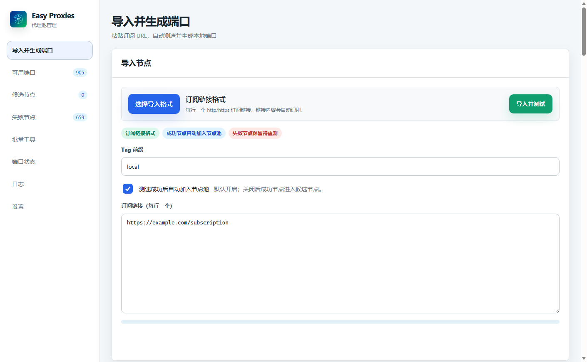
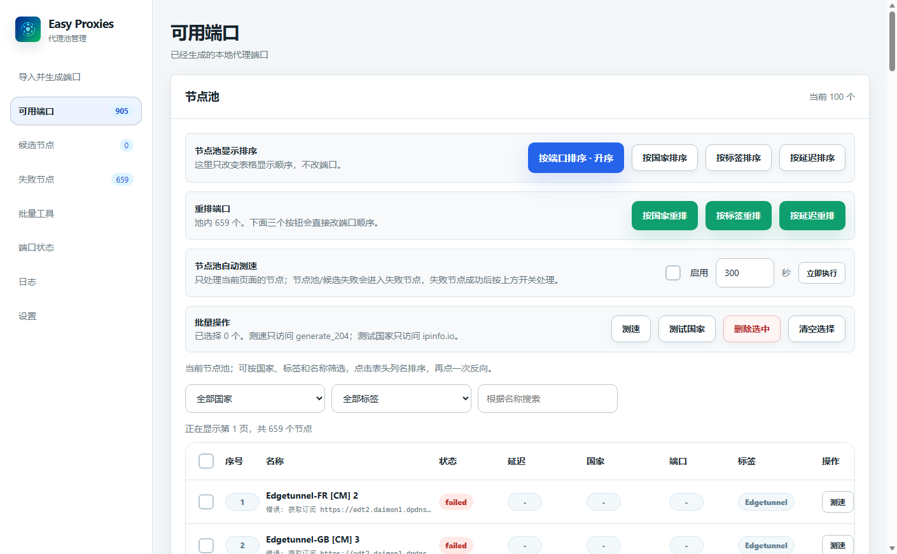
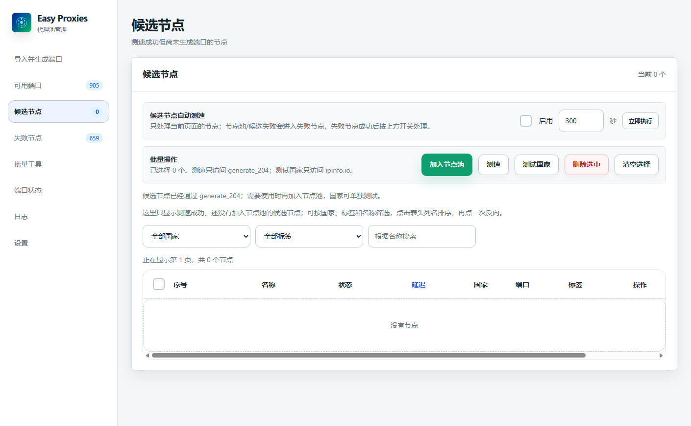
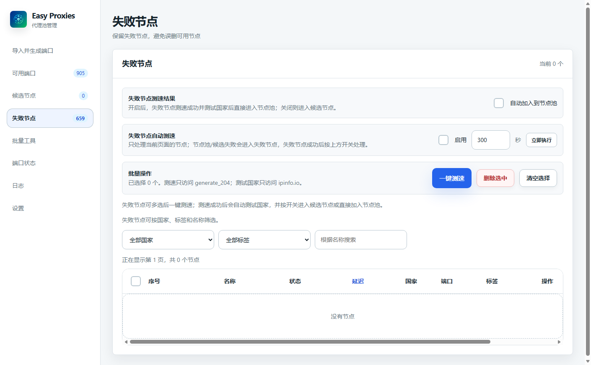
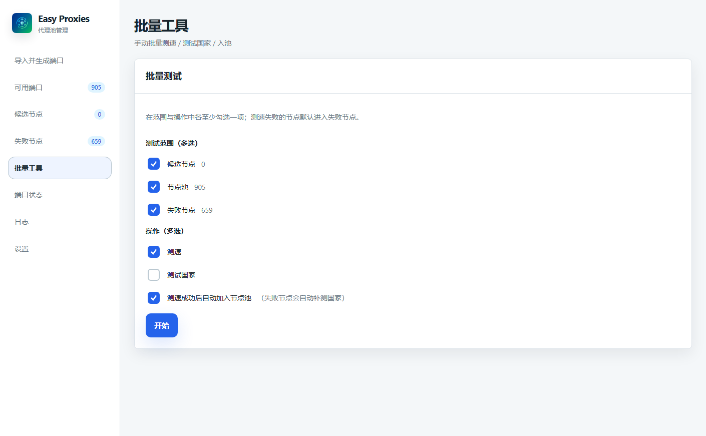
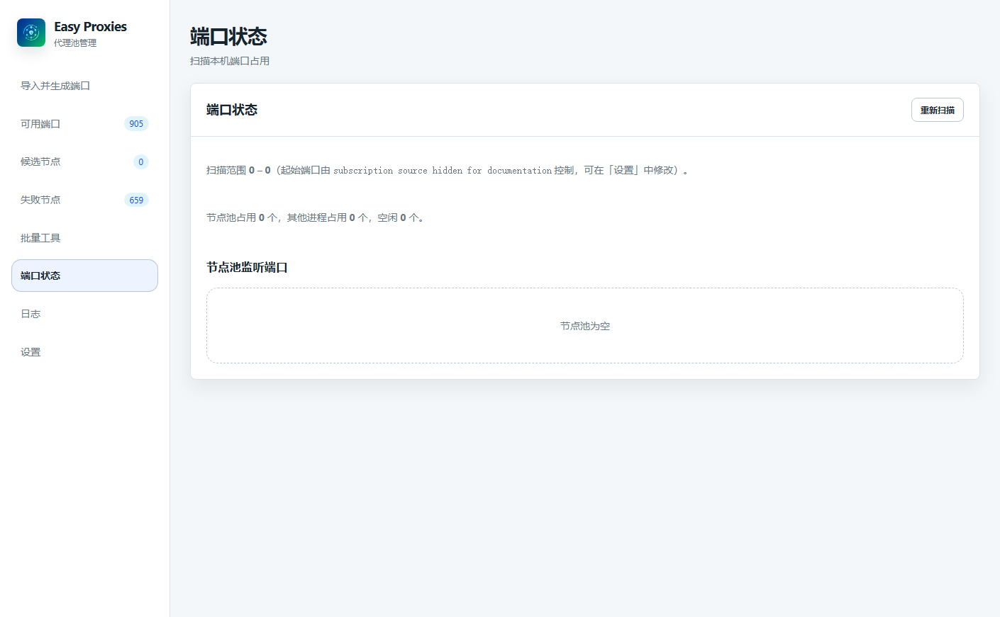
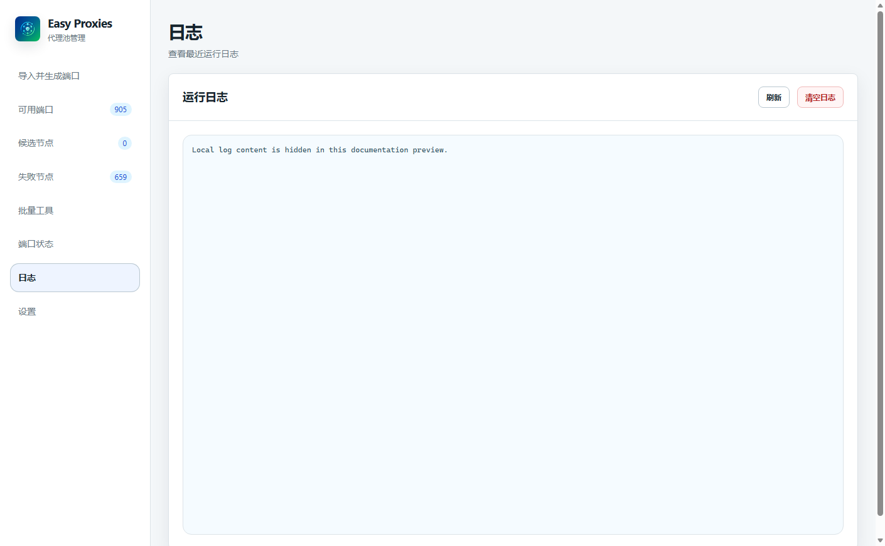
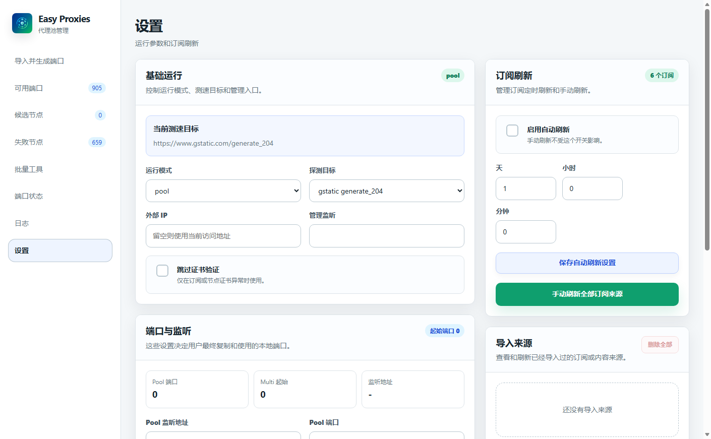

<p align="center">
  
</p>

<h1 align="center">Easy Proxies</h1>

<p align="center">A subscription-first proxy node importer, tester, pool manager, and multi-port gateway powered by sing-box.</p>

<p align="center">
  <a href="./README.md">English</a> ·
  <a href="./README.zh-CN.md">简体中文</a> ·
  <a href="./README.zh-TW.md">繁體中文</a>
</p>

<p align="center">
  
  
  
  
  <a href="https://github.com/daimon3332/easy-proxies/releases/latest"></a>
</p>

> Easy Proxies is a community-maintained fork of [jasonwong1991/easy_proxies](https://github.com/jasonwong1991/easy_proxies). This fork focuses on a redesigned WebUI, subscription importing, reliable node testing, node lifecycle management, and an easier multi-port workflow.

## What it does

Easy Proxies turns one or more proxy subscription URLs into local HTTP/SOCKS5 ports:

```text
Paste subscription URLs
  -> parse nodes
  -> test every node
  -> automatically add passed nodes to the pool
  -> assign local ports starting at 24000
  -> copy and use the generated ports
```

The default runtime mode is `multi-port`, so every passed node receives its own local port. **Automatically add passed nodes to the pool** is enabled by default for first-time use.

## ✨ Key features

- 🔗 Subscription-first WebUI workflow.
- Imports HTTP/HTTPS subscriptions, URI lists, Base64 content, and Clash/Mihomo YAML.
- Imports plain `host:port` and optional `user:pass@host:port` lists as HTTP or SOCKS5 nodes.
- ⚡ Concurrent and asynchronous node testing with live progress.
- 🔀 Optional front-proxy profiles for chained routes, using any proxy URI protocol supported by the current sing-box build.
- Subscription fetching keeps the standard direct-first strategy with bounded fallback through available pooled proxies; the selected front proxy is used only for the chained node route.
- Chained imports report the front-proxy baseline and the complete route separately; terminal nodes are not tested by direct connection.
- Site connectivity checks run against any selected tags for Google, GitHub, Outlook, and ProxySpace, support a per-run 1-60 second timeout with a 10-second default, and can rebuild ports from the strict intersection of selected sites.
- 🧩 Keeps candidate, pooled, and failed nodes instead of silently dropping failures.
- Automatically promotes passed imports to the node pool by default.
- 🔌 One local port per node in the default `multi-port` mode.
- Optional `pool` and `hybrid` runtime modes.
- Batch retest, country detection, subscription refresh, port inspection, and logs.
- Probe target selection between `https://www.gstatic.com/generate_204` and `https://cp.cloudflare.com/generate_204`.
- WebUI and REST API served from the same management endpoint.

## ⚙️ Reliability and performance

- A shared probe runtime reuses sing-box services instead of creating a complete runtime for every retry.
- Probe work uses bounded asynchronous workers, delayed retries, alternate targets, and cross-job de-duplication.
- A pooled node is only reported as passed after its actual local multi-port listener also reaches the probe target.
- Source refresh, local URI/YAML/Base64 retesting, cancellation, and pool updates use transactional recovery and bounded queues.
- Runtime diagnostics expose startup stages, listener counts, memory, goroutines, and probe queues without exposing node credentials or subscription URLs.

## 🖼️ WebUI preview

<details>
<summary>Show all interface screenshots</summary>
<br>

### Import and create ports



### Available ports



### Candidate nodes



### Failed nodes



### Batch tools



### Port status



### Logs



### Settings



</details>

## Getting started
Follow the **[English User Guide](./docs/USER_GUIDE.md)** for two startup methods:

1. Clone the source, build Easy Proxies locally, and start the binary.
2. Download the matching binary package from [Releases](https://github.com/daimon3332/easy-proxies/releases/latest) and start it.

## Import formats and protocols

Import formats:

- HTTP/HTTPS subscription URL
- Proxy URI list
- Base64-encoded URI list
- Clash/Mihomo YAML `proxies` section
- Plain Host:Port list, one entry per line: `host:port` or `user:pass@host:port` (HTTP/SOCKS5 selected during import)

Common protocols include VLESS, VMess, Trojan, Shadowsocks, ShadowsocksR, Hysteria, Hysteria2, TUIC, AnyTLS, HTTP/HTTPS, SOCKS4, and SOCKS5. Actual protocol availability depends on the sing-box version and build tags.

For chained imports, configure a front-proxy profile in Settings and select it during import. Subscription content is still fetched by the standard direct-first strategy with bounded fallback through available pooled proxies. A successful result means both the front proxy and the complete `front proxy -> imported node -> probe target` route passed. Individual protocols still need a compatible transport path; for example, a UDP-dependent terminal cannot use a front proxy that only provides TCP tunneling.

## Runtime modes

| Mode | Behavior |
| --- | --- |
| `multi-port` | Default. Assign one local port to every pooled node. |
| `pool` | Expose one shared proxy entry and schedule across pooled nodes. |
| `hybrid` | Enable the shared pool entry and per-node ports together. |

`multi_port` is accepted in configuration files and normalized to `multi-port`.

## Development and contributing

For source setup, build tags, tests, branch conventions, and the pull request workflow, see **[CONTRIBUTING.md](./CONTRIBUTING.md)**.

## Troubleshooting

The user guide covers startup errors, missing ports, and browser-saved import options. When a passed node does not use the expected port, check the WebUI port page because occupied ports are skipped automatically.

## Upstream and acknowledgements

- [jasonwong1991/easy_proxies](https://github.com/jasonwong1991/easy_proxies) — upstream project
- [SagerNet/sing-box](https://github.com/SagerNet/sing-box) — proxy platform and protocol implementation

## 🔗 Community

- [linux.do](https://linux.do): **Learn AI at L-Site!!!**

## License

Distributed under the [MIT License](./LICENSE). This project retains attribution for the upstream project and MIT-licensed portions on which it is based.
