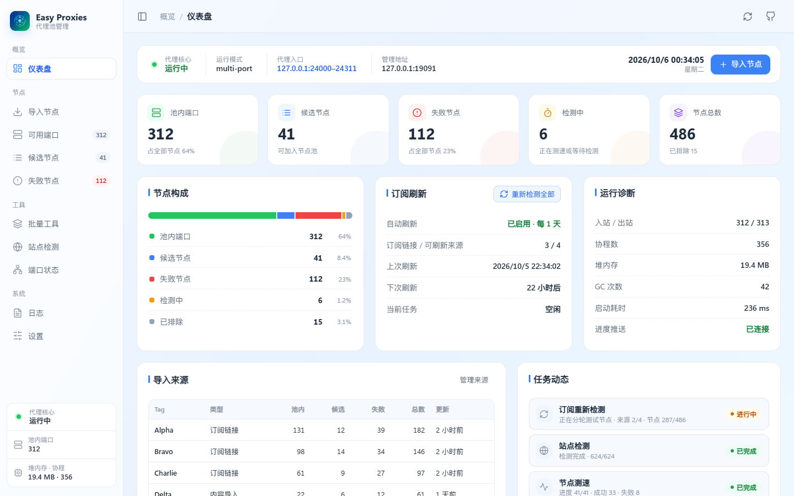
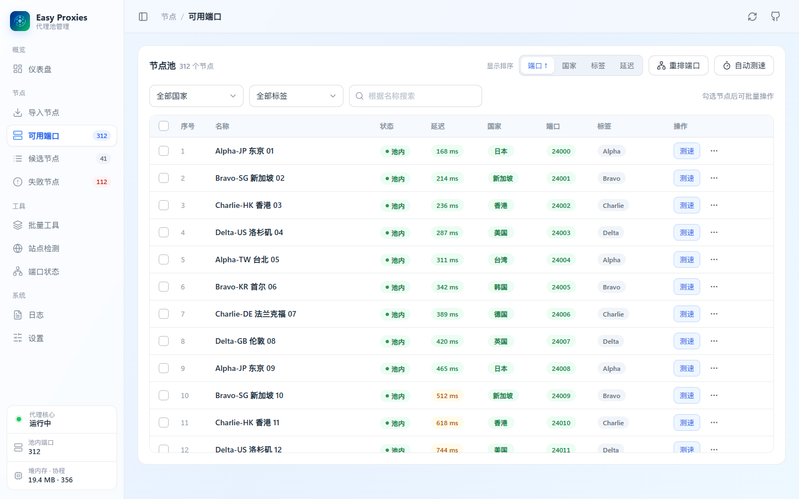
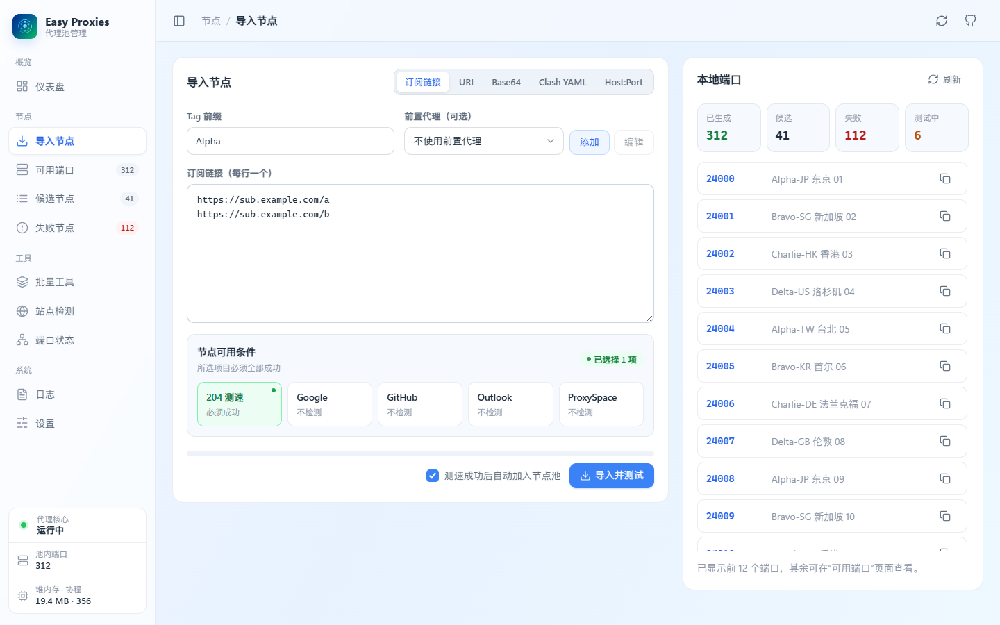

<p align="center">
  
</p>

<h1 align="center">Easy Proxies</h1>

<p align="center">A subscription-first proxy node importer, tester, pool manager, and multi-port gateway powered by sing-box.</p>

<p align="center">
  <a href="./README.md">English</a> ·
  <a href="./README.zh-CN.md">简体中文</a>
</p>

<p align="center">
  
  
  
  
  <a href="https://github.com/daimon3332/easy-proxies/releases/latest"></a>
</p>

> A community-maintained fork of [jasonwong1991/easy_proxies](https://github.com/jasonwong1991/easy_proxies) with a redesigned WebUI, subscription importing, reliable node testing, and an easier multi-port workflow.

## What it does

Paste subscription URLs, and Easy Proxies parses and tests every node, adds the passing ones to the pool, and gives each one a local HTTP/SOCKS5 port starting at `24000`.

## Features

- Imports HTTP/HTTPS subscriptions, URI lists, Base64, Clash/Mihomo YAML, and plain `host:port` / `user:pass@host:port` lists.
- Concurrent multi-round testing with live progress; candidate, pooled, and failed nodes are all kept.
- Optional front-proxy profiles for chained routes, retested before they are applied.
- Site checks for Google, GitHub, Outlook, and ProxySpace that can rebuild ports from the nodes passing every selected site.
- Scheduled subscription refresh with transactional rollback, plus batch retest and country detection.
- Dashboard with pool, refresh, and runtime status; the WebUI and REST API share one management endpoint.
- Local and WebDAV backups, per-tag data export.

## WebUI preview



<details>
<summary>More screenshots</summary>
<br>

<br><br>

</details>

## Getting started

Download a package from [Releases](https://github.com/daimon3332/easy-proxies/releases/latest) or build from source, copy `config.example.yaml` to `config.yaml`, then run:

```bash
./easy_proxies -config config.yaml
```

Open the WebUI at the `management.listen` address (default `http://127.0.0.1:9091`). See the **[User Guide](./docs/USER_GUIDE.md)** for package selection, build commands, and troubleshooting.

## Supported protocols

VLESS, VMess, Trojan, Shadowsocks, ShadowsocksR, Hysteria, Hysteria2, TUIC, AnyTLS, HTTP/HTTPS, SOCKS4, and SOCKS5. Availability depends on the sing-box version and build tags.

## Runtime modes

| Mode | Behavior |
| --- | --- |
| `multi-port` | Default. One local port per pooled node. |
| `pool` | One shared entry that schedules across pooled nodes. |
| `hybrid` | Both the shared entry and per-node ports. |

## Contributing

See **[CONTRIBUTING.md](./CONTRIBUTING.md)**.

## Acknowledgements

- [jasonwong1991/easy_proxies](https://github.com/jasonwong1991/easy_proxies) — upstream project
- [SagerNet/sing-box](https://github.com/SagerNet/sing-box) — proxy platform and protocol implementation
- [linux.do](https://linux.do) community

## License

[MIT](./LICENSE). Attribution for the upstream project and MIT-licensed portions is retained.
