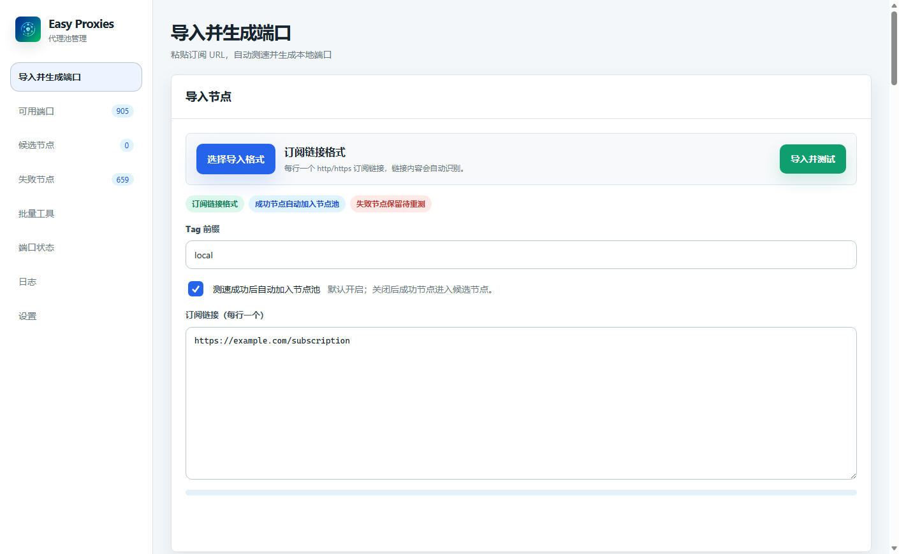
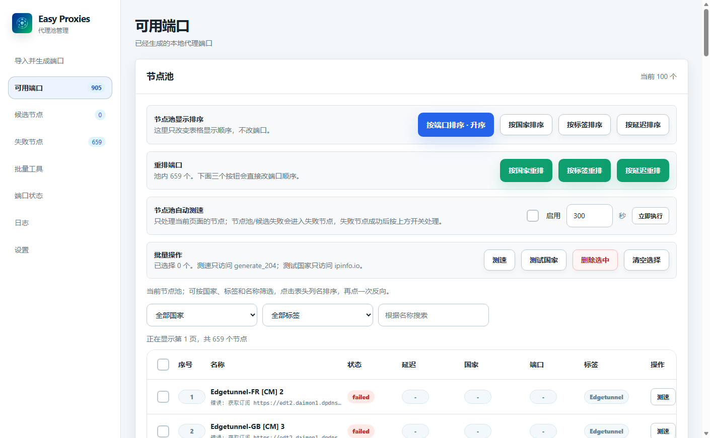
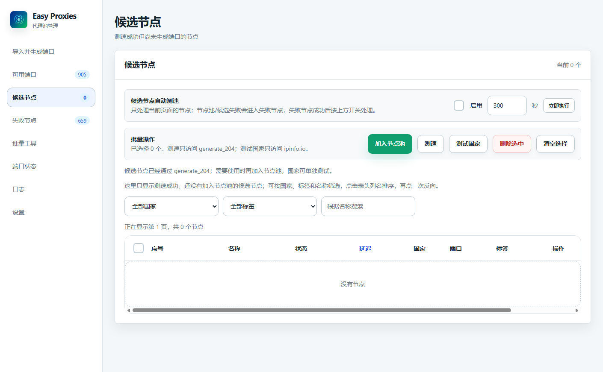
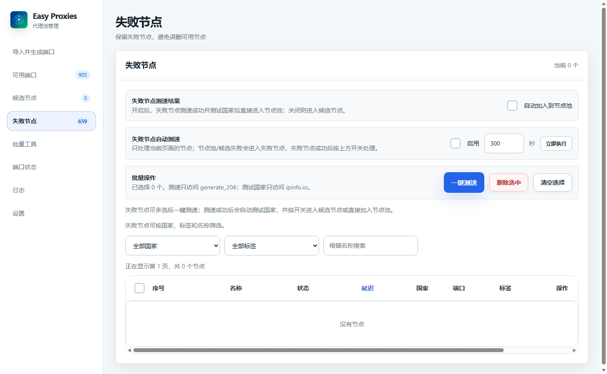
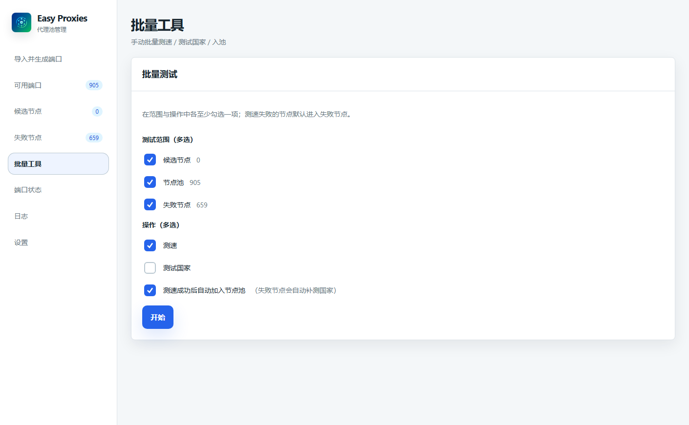
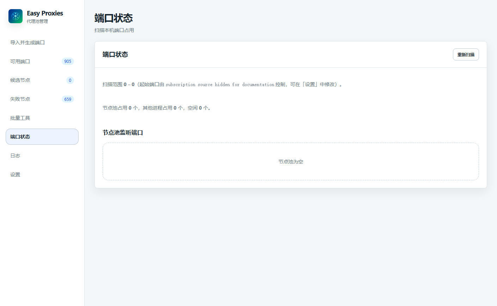
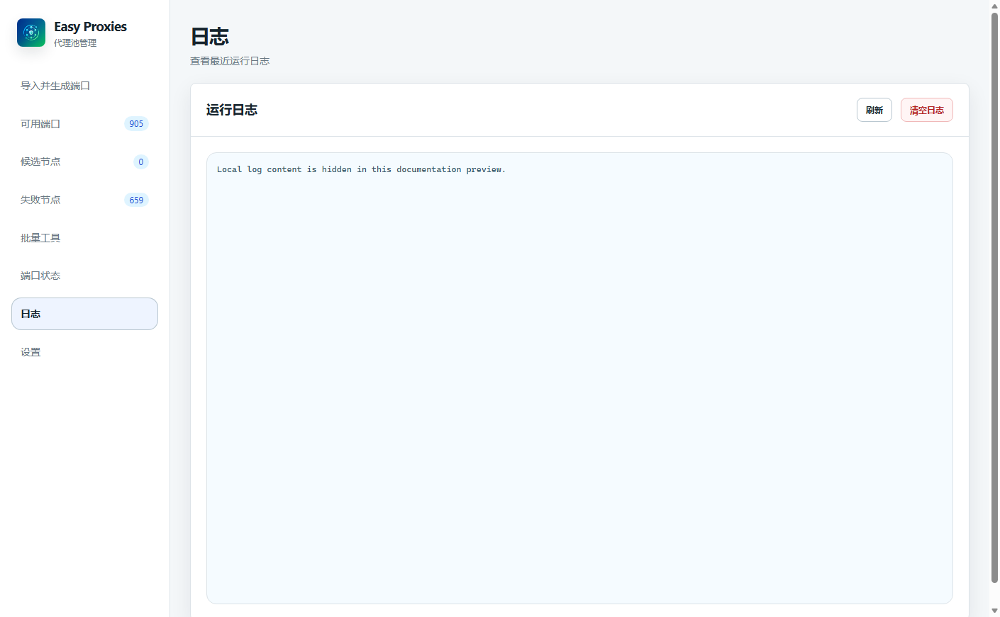
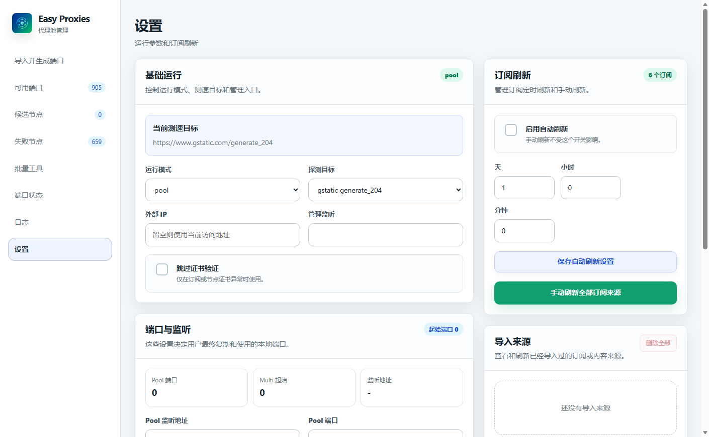

<p align="center">
  
</p>

<h1 align="center">Easy Proxies</h1>

<p align="center">以 sing-box 為基礎的訂閱匯入、節點測速、節點池管理與多連接埠代理工具。</p>

<p align="center">
  <a href="./README.md">English</a> ·
  <a href="./README.zh-CN.md">简体中文</a> ·
  <a href="./README.zh-TW.md">繁體中文</a>
</p>

<p align="center">
  
  
  
  
</p>

> 本專案基於 [jasonwong1991/easy_proxies](https://github.com/jasonwong1991/easy_proxies) 二次開發，重點改善 WebUI、訂閱匯入、節點測速、節點生命週期管理與多連接埠使用體驗。

## 專案用途

Easy Proxies 可以把一個或多個代理訂閱 URL 轉換成本機 HTTP/SOCKS5 代理連接埠：

```text
貼上訂閱 URL
  -> 解析節點
  -> 測試全部節點
  -> 成功節點自動加入節點池
  -> 從 24000 開始分配本機連接埠
  -> 複製連接埠並直接使用
```

預設執行模式是 `multi-port`，每個測速成功並進入節點池的節點都會取得獨立本機連接埠。首次使用時，「測速成功後自動加入節點池」預設開啟。

## ✨ 核心功能

- 🔗 面向一般使用者的訂閱優先 WebUI 流程。
- 支援 HTTP/HTTPS 訂閱、URI 清單、Base64 內容和 Clash/Mihomo YAML。
- ⚡ 並行、非同步節點測速和即時進度。
- 🧩 分別保留候選節點、節點池節點和失敗節點。
- 匯入測速成功後預設自動加入節點池。
- 🔌 預設 `multi-port` 模式下每個節點使用獨立連接埠。
- 可選 `pool` 和 `hybrid` 模式。
- 支援批次重測、國家檢測、訂閱重新整理、連接埠檢視和執行日誌。
- 探測目標僅支援 `https://www.gstatic.com/generate_204` 和 `https://cp.cloudflare.com/generate_204`。
- WebUI 與 REST API 共用管理入口。

## 🖼️ WebUI 預覽

<details>
<summary>顯示全部介面截圖</summary>
<br>

### 匯入並生成連接埠



### 可用連接埠



### 候選節點



### 失敗節點



### 批次工具



### 連接埠狀態



### 日誌



### 設定



</details>

## 開始使用

一般使用者應從 [Releases](https://github.com/daimon3332/easy-proxies/releases/latest) 下載與作業系統和 CPU 架構相符的 ZIP 壓縮包。

```text
下載 Release
  -> 將 config.example.yaml 複製為 config.yaml
  -> 啟動 Easy Proxies
  -> 開啟 WebUI
  -> 匯入訂閱 URL 並測速
  -> 使用產生的本機連接埠
```

下載選擇、啟動指令、訂閱匯入、節點測速和常見問題請參閱 **[繁體中文使用教學](./docs/USER_GUIDE.zh-TW.md)**。

## 匯入格式與協定

支援 HTTP/HTTPS 訂閱 URL、代理 URI 清單、Base64 編碼 URI 清單，以及 Clash/Mihomo YAML 的 `proxies` 區段。

常見協定包括 VLESS、VMess、Trojan、Shadowsocks、ShadowsocksR、Hysteria、Hysteria2、TUIC、AnyTLS、HTTP/HTTPS、SOCKS4 和 SOCKS5。實際協定能力取決於 sing-box 版本與建置標籤。

## 執行模式

| 模式 | 行為 |
| --- | --- |
| `multi-port` | 預設模式，每個節點分配一個本機連接埠。 |
| `pool` | 所有節點共用一個代理入口，由節點池排程。 |
| `hybrid` | 同時啟用共用入口和每節點獨立連接埠。 |

設定中的 `multi_port` 寫法也受支援，並會自動正規化為 `multi-port`。

## 資料與隱私

以下可能包含訂閱 URL、憑證、節點 URI、執行狀態或本機日誌的檔案已被 Git 忽略：

```text
config.yaml
nodes.txt
managed_nodes.json
node_ports.json
*.log
*.mmdb
```

提交程式碼時請使用 `config.example.yaml`。公開既有儲存庫前還需要檢查完整 Git 歷史，因為加入 `.gitignore` 不會移除舊提交中的檔案。

## 二次開發與貢獻

原始碼環境、建置標籤、測試指令、分支規範和 Pull Request 流程請參閱 **[CONTRIBUTING.md](./CONTRIBUTING.md)**。

## 常見問題

使用教學包含啟動錯誤、連接埠分配、瀏覽器儲存的匯入選項和 macOS Gatekeeper 處理方式。測速成功的節點沒有使用預期連接埠時，請查看 WebUI 的連接埠頁面；被其他程式占用的連接埠會自動略過。

## 上游專案與致謝

- [jasonwong1991/easy_proxies](https://github.com/jasonwong1991/easy_proxies) — 上游專案
- [SagerNet/sing-box](https://github.com/SagerNet/sing-box) — 代理平台與協定實作

## 授權條款

本專案採用 [MIT License](./LICENSE)，並保留對上游專案及其 MIT 授權程式碼的歸屬說明。
